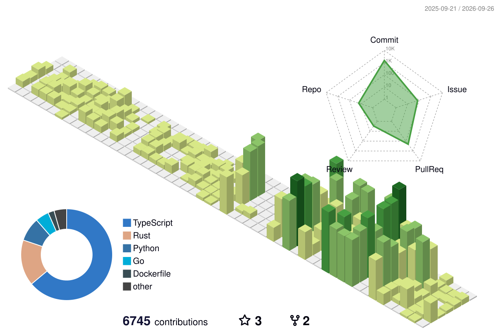

  

 

I like to build software for making harder things easier.

**TypeScript &nbsp;·&nbsp; Python &nbsp;·&nbsp; Go &nbsp;·&nbsp; Rust**

---
<!-- stats:start -->

  

<em>Building and maintaining open-source tools.</em>

### 🚧 happening now

<table>
<tr>
<td width="50%" align="center">
<a href="https://github.com/uinstinct/git-author-reformer"><strong>git-author-reformer</strong></a> 
 
a simple one-line tool to change, rename, remove git commit authors in bulk or selection
</td>
<td width="50%" align="center">
<a href="https://github.com/uinstinct/aiskills"><strong>aiskills</strong></a> 
 
ai skills used for my harnesses
</td>
</tr>
<tr>
<td width="50%" align="center">
<a href="https://github.com/uinstinct/claude-code-researcher"><strong>claude-code-researcher</strong></a> 
 
Docker-based Claude Code runner for long-running research tasks
</td>
<td width="50%" align="center">
<a href="https://github.com/uinstinct/questionnairebot"><strong>questionnairebot</strong></a> 
 
a telegram questionnairebot to ask weekly checkin type questions
</td>
</tr>
</table>

### ✅ recently finished

<table>
<tr>
<td width="50%" align="center">
<a href="https://github.com/uinstinct/SkyReminder"><strong>SkyReminder</strong></a> 
 
An aeriel advertising propeller plane sends you reminders!
</td>
<td width="50%" align="center">
<a href="https://github.com/uinstinct/svelte-wheel-picker"><strong>svelte-wheel-picker</strong></a> 
 
iOS-style wheel picker for svelte
</td>
</tr>
</table>

---

<em>Projects I got the chance to work as part of the core team.</em>

 

<table>
<tr>
<td width="33%" align="center">
<a href="https://github.com/continuedev/continue"><strong>continuedev/continue</strong></a> 
 
 
</td>
<td width="33%" align="center">
<a href="https://github.com/ir-engine/etherealengine-archive"><strong>etherealengine/etherealengine</strong></a> 
 
 
</td>
<td width="33%" align="center">
<a href="https://github.com/RocketChat/Rocket.Chat"><strong>RocketChat/Rocket.Chat</strong></a> 
 
 
</td>
</tr>
</table>

<!-- stats:end -->
---

